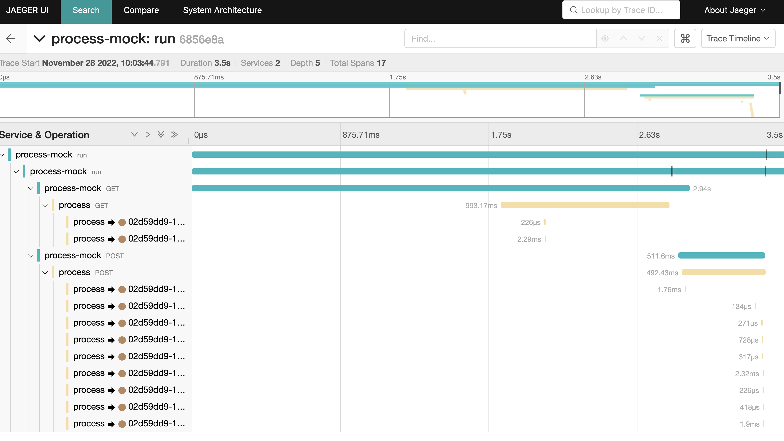

# Demo Embedded Camunda

## Freezing

This project freezing after news about Camunda 7 End of Life. 

> The EoL date for Camunda 7 Community Edition has not changed. Please note that the final feature release for Camunda 7 (7.24) is still scheduled for October 14, 2025, and the repository will be archived shortly after. After this date, no further releases, including security patches, will be made for Camunda 7 Community Edition.

## Build and launch

```sh
./mk.sh 
xdg-open http://localhost:8089/
```

## Process


## Jaeger



## To Do

- [ ] add new screenshots
- [ ] add builddocs

## See also

- https://reflectoring.io/spring-boot-tracing/
- https://camunda.com/blog/2022/10/monitoring-camunda-platform-7-with-prometheus/

- Тестирование -- https://habr.com/ru/company/simbirsoft/blog/657697/

- https://blog.viadee.de/en/camunda-external-tasks-error-handling-and-retry-behavior
- https://blog.viadee.de/en/camunda-external-task-worker

- https://docs.camunda.io/docs/components/best-practices/development/invoking-services-from-the-process-c7/
- https://github.com/camunda-consulting/camunda-7-code-examples/tree/master/snippets

- https://camunda.com/blog/2022/02/moving-from-embedded-to-remote-workflow-engines/
- https://github.com/camunda/camunda-bpm-examples/tree/master/spring-boot-starter/external-task-client/request-interceptor-spring-boot

- https://github.com/camunda/camunda-bpm-examples/blob/master/spring-boot-starter/external-task-client/order-handling-spring-boot/src/main/java/org/camunda/bpm/spring/boot/example/Subscriptions.java
